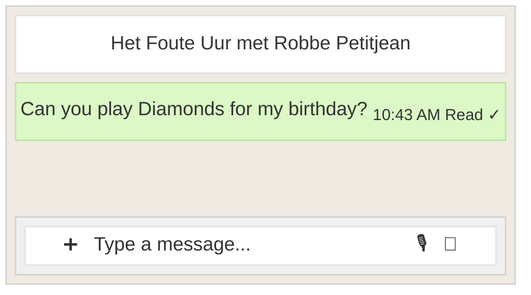
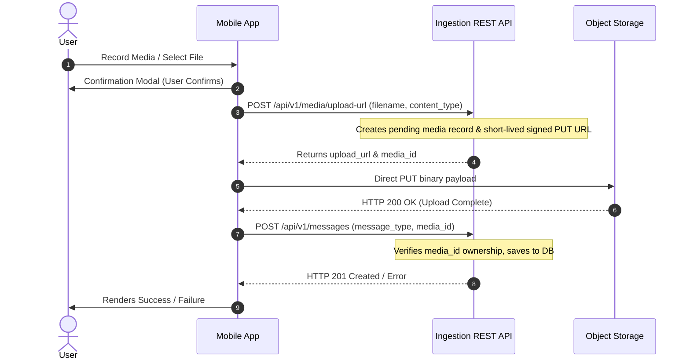
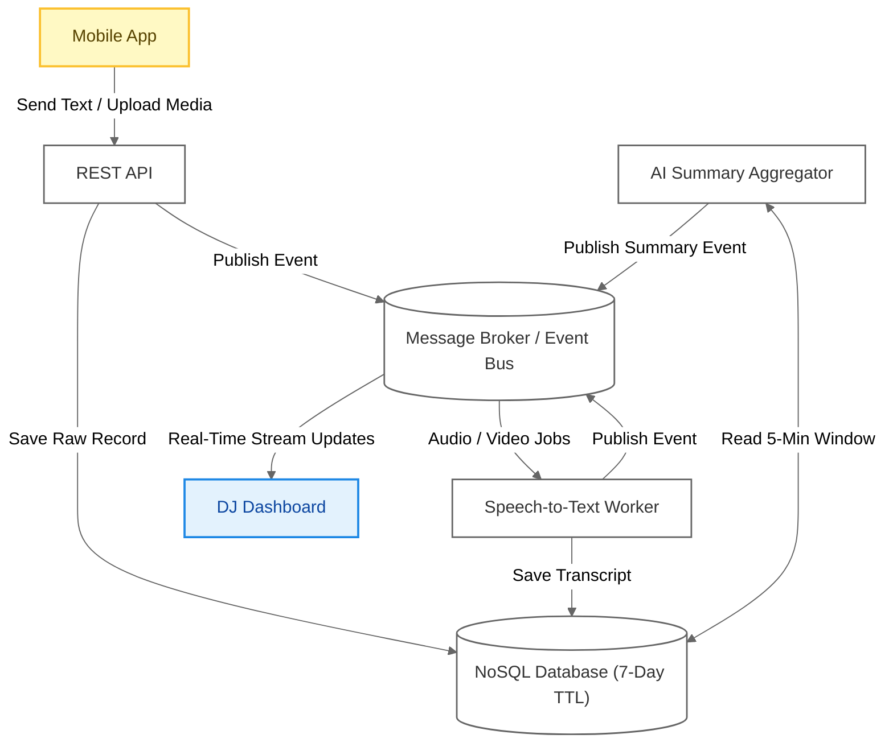
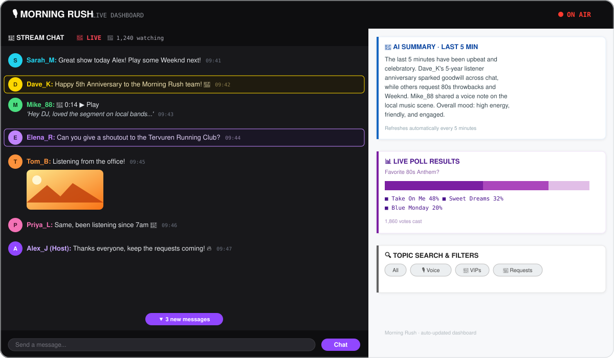

# Architecture Design Document: Real-Time Listener Interaction Platform

## 1. Background
Our radio stations maintain constant engagement with listeners via mobile apps. Listeners send text, photos, audio, and video clips live during broadcasts. DJs operate in a fast-paced environment where they must consume incoming listener content at a glance without disrupting their on-air workflow.

## 2. Problem Statement
* **Information Overload**: High-volume shows generate thousands of concurrent messages, making it impossible for DJs to read every text or listen to/watch every media submission.

* **Media Latency**: Audio and video clips contain valuable on-air content but create playback bottlenecks. Speech-to-text (STT) models (e.g., Whisper) add processing delay.

* **Message Prioritization**: DJs need immediate visibility into high-value messages (top fans, ...) and quick macro-level context (trending topics, active polls) alongside the live chat stream.

## 3. Solutions Considered

### Solution 1: Synchronous Monolith with Inline Media Processing

**Concept:** Direct REST submission where text, media upload, transcription, and AI summarization occur synchronously in a single request lifecycle before returning a response.

**Benefits:** 
* Simple architecture
* Message completeness upon success
* Flexible source retention (can keep or immediately discard raw media after processing to save storage)

**Drawbacks:** 
* High-traffic spikes exhaust connection pools as threads sit idle waiting on external API processing calls, blocking quick text messages
* Requires strict file size caps on audio and video to keep request times under timeout limits

### Solution 2: Direct Client-Side Transcription & Edge Processing

**Concept:** Offload STT transcription and video processing directly to listener mobile devices prior to API upload.

**Benefits:**
* Lower server-side compute and transcription costs
* Backend receives pre-transcribed text instantly without background queue processing

**Drawbacks:**
* Exposes proprietary API keys on client devices
* Drains user battery and mobile data
* Performance varies wildly depending on individual user device hardware and network conditions
* No media access

### Solution 3: Direct WebSocket Streaming Architecture
**Concept:** The mobile app maintains a persistent, bi-directional WebSocket connection to the backend. Text, audio/video binary frames, and status updates stream over a single open pipe.

**Benefits:**
* Eliminates HTTP request overhead, delivering text and media in milliseconds.
* Enables instant server feedback back to the user
* Media can stream while recording, starting transcription before the user even taps send

**Drawbacks:**
* Keeping idle connections open consumes heavy memory and socket capacity on edge servers
* Switching between Wi-Fi and mobile networks drops connections, requiring client-side reconnection logic
* Stateful connections require specialized proxying and load balancing instead of simple HTTP routing

### Solution 4 (Proposed): Asynchronous REST Ingestion with Event-Driven Pipeline

**Concept:** Ingest text messages and standalone media asynchronously via a REST API using direct-to-object-storage presigned upload URLs. Event queues handle Whisper speech-to-text (for audio/video) and LLM summarization, streaming progressive real-time updates to the DJ dashboard via WebSockets.

**Benefits:**
* Raw media and waveforms appear on the DJ dashboard instantly without blocking the API
* Decouples message ingestion from heavy processing
* Large media files upload directly to object storage, keeping API server bandwidth and memory footprint minimal

**Drawbacks:**
* Higher architectural complexity
  
## 4. High Level Design

### A. Mobile App Flow (User Interface)

#### 1. Look & Feel (UI/UX Design)


<p align="center" color="#666">Conceptual Design - Mobile Chat App</p>

* Station header displays the current Live Show & DJ title as the chat header
* Timeline with explicit send feedback (delivery checkmarks on success, red retry banner on failure)
* WhatsApp-style Input Bar & Controls:
  * Text Field: Standard text input for instant text-only messaging
  * Voice Record & Video Record buttons: Captures standalone media. Always requires a preview confirmation modal before dispatch.
  * File Upload: Attachment picker for photo/video (limited to one). Supports optional text captions.

> **Potential Improvements:**
> * Show picker to select different/upcoming DJs
> * Opt-in public feed to let listeners view and react to community messages
> * Multiple attachments support

#### 2. Message and Media Upload Flow



#### 3. API Schemas & Endpoints

##### Presigned Upload URL Endpoint

* Request: POST /api/v1/media/upload-url
``` json
{
  "file_name": "voice_note_2026_08_10.m4a",
  "content_type": "audio/m4a"
}
```

* Response: 200 OK
```json
{
  "media_id": "med_abc890_m4a",
  "upload_url": "https://storage...",
  "expires_in": 300
}
```

##### Send Message Endpoint
* Request: POST /api/v1/messages

```json
{
  "user_id": "usr_98765",
  "message_type": "TEXT | AUDIO | VIDEO | PICTURE",
  "text_content": "hello",
  "media_id": "med_abc890_m4a"
}
```

* Response: 201 Created

```json
{
  "message_id": "msg_99887766",
  "status": "RECEIVED",
  "media_id": "med_abc890_m4a",
  "created_at": 1786283437
}
```

### B. Backend & Storage Architecture



| Component | Architecture Role | Execution Model |
| --- | --- | --- |
| **REST API** | Accepts incoming text payloads and handles presigned URL generation for binary uploads (audio/video). | Synchronous HTTP |
| **Message Broker / Event Bus** | Real-time event backbone distributing jobs to worker queues and streaming events to connected client sessions. | Async Pub/Sub & Queueing |
| **Speech-to-Text Worker** | Transcribes incoming audio and video files using speech recognition models (e.g., Whisper). | Asynchronous Queue Consumer |
| **AI Summary Aggregator** | Heavy-context LLM that reads the rolling 5-minute message window to generate macro-level narrative summaries for the DJ. | Batch / Scheduled (Cron) |
| **NoSQL Database** | Persistent datastore storing raw messages, enriched transcripts, and generated summaries (enforces a 7-Day TTL). | Document / Key-Value |

#### Redis Pub/Sub & WebSocket Service Architecture

Using **Redis** as the real-time message broker decoupling backend workers and ingestion APIs from front-end WebSocket state:

1. **Pub/Sub Channels:** Backend components publish events directly to designated Redis channels:
  * `chat:events:stream` — Real-time listener messages, audio/video uploads, and STT transcripts.
  * `chat:events:summary` — Rolling 5-minute global narrative updates generated by the AI Summary Aggregator.
2. **WebSocket Gateway Cluster:** Horizontal WebSocket nodes subscribe to Redis Pub/Sub channels and instantly fan out events to connected DJ Dashboard clients.
3. **Transient Message Cache:** Redis holds a ring-buffer of recent messages for instant state recovery if a DJ Dashboard reloads or re-establishes a WebSocket connection.

#### NoSQL Database Schema
* **Partition Key (PK):** STATION_ID#SHOW_ID | Sort Key (SK): TIMESTAMP
* **Attributes:** Stores user_id, payload_type, text, transcribed_text, ai_generated_text, media_url, is_vip
* **Auto-Cleanup:** ttl attribute set to expire and purge records automatically after 7 days

### C. Studio & DJ Dashboard Layout

<p align="center">
  
</p>
<p align="center">
  <sub>Conceptual Design — Live DJ & Studio Dashboard</sub>
</p>

#### Left Panel: Live Stream Chat

A real-time listener feed engineered for rapid studio scanning and instant live-air interaction.

* **Listener Messages & Profiles:** Displays listener avatars alongside truncated message previews (could be the translated text or the AI-generated summary) to maximize screen real estate.
  * **Expandable Content:** Includes a "More" button to expand the full message.
  * **VIP Highlighting:** Priority visually highlights messages from VIP listeners or top contributors.
* **Rich Inline Media:**
  * **Photos:** Displayed directly within the chat stream.
  * **Audio Messages:** Rendered inline with an interactive waveform to play the message.
  * **Video Messages:** Embedded inline with a dedicated play button.
  * All the media should have broadcast integration.

#### Right Panel: Real-Time Show Insights
Stacked, modular widgets providing high-level operational metrics and content discovery tools for the producer and DJ.

1. **AI Live Summary (Rolling 5-Min Window):**
   * An auto-generated, rolling narrative summarizing recent chat activity and on-air discussion. Refreshes continuously so producers can catch up at a single glance.
2. **Live Poll Results:**
   * Real-time metrics and active listener response breakdowns for ongoing show polls.
3. **Topic Search & Smart Filters:**
   * Instant search and taxonomy filters to isolate specific keywords, trending topics, or flagged messages across the stream.
